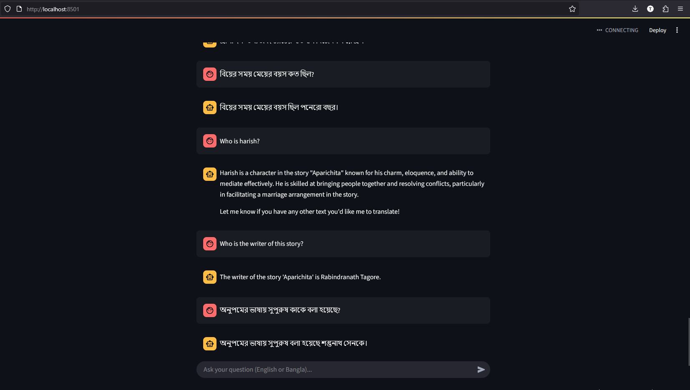

# 📖 Bangla RAG

**This project implements a Retrieval-Augmented Generation (RAG) based chatbot that can understand and answer both Bangla and English queries. It retrieves context from a PDF knowledge base and uses a Language Model to generate grounded and relevant answers.**  

 
▶ **Watch Project Explanation Video**: [Youtube Video Link](https://www.youtube.com/watch?v=9ZHEgCL3BcA)
---

## 📂 **Project Structure**  
```
.
├── app/  
│   ├── api.py             # FastAPI backend for RAG queries  
│   ├── main.py            # Streamlit chatbot frontend  
│   ├── RAG.py             # RAG pipeline implementation  
│   ├── evaluation.py      # Evaluates RAG accuracy  
│   └── test_cases.txt     # Test cases for evaluation
├── data/  
│   ├── bangla.pdf         # Input Bangla document  
│   └── processed.txt      # Preprocessed text  
├── embeddings/            # Stores vector embeddings  
├── evaluation/  
│   └── test_cases.txt     # Test cases for evaluation  
├── Preprocess.ipynb       # Preprocesses bangla.pdf → processed.txt  
├── requirements.txt       # Python dependencies  
└── README.md  
```

---

## 🛠 **Setup Guide**  

### **1. Install Dependencies**  
```bash
git clone https://github.com/Md-Shoaib-Abdullah-Khan/Bangla-RAG
cd Bangla-RAG
python -m venv myenv
source myenv/bin/activate        # On Windows: myenv\\Scripts\\activate
pip install -r requirements.txt
```

### **2. Configure Environment Variables**  
Create a `.env` file:  
```env
GROQ_API_KEY="your_groq_api_key"
```

### **3. Preprocess Data**  
Run the Jupyter notebook to extract text from `bangla.pdf`:  
```bash
jupyter notebook Preprocess.ipynb
```
*(Output: `data/processed.txt`)*  

### **4. Run the Chatbot**  
**Option 1: FastAPI Backend**  
```bash
python app/api.py
```
→ Access API docs at `http://127.0.0.1:8000/docs`  

**Option 2: Streamlit Frontend**  
```bash
streamlit run app/main.py
```
→ Opens chatbot at `http://localhost:8501`  

---

## 🧰 **Used Tools & Libraries**  
- **LLM**: Groq: `deepseek-r1-distill-llama-70b` & `gemma2-9b-it`
- **Embeddings**: HuggingFace: `l3cube-pune/bengali-sentence-similarity-sbert`  
- **Backend**: FastAPI  
- **Frontend**: Streamlit  
- **Vector DB**: Chroma (local)  
- **Evaluation**: Cosine similarity

*(List all packages in `requirements.txt`)*  

---

## 📡 **API Documentation**  
### **POST `/ask`**  
**Input**:  
```json
{"query": "বিয়ের সময় কল্যাণীর বয়স কত ছিল?"}
```  
**Output**:  
```json
{
  "question": "বিয়ের সময় কল্যাণীর বয়স কত ছিল?",
  "answer": "পনের বছর",
}
```

---

## 🔍 **Sample Query & Output**  
|                  **Query**                      |            **Generated Answer**               |
|-------------------------------------------------|-----------------------------------------------|
| "কাকে অনুপমের ভাগ্য দেবতা বলে উল্লেখ করা হয়েছে?" |                  "মামাকে"                     |  

---

## 📊 **Evaluation Metrics**  
Run evaluation:  
```bash
python app/evaluation.py
```  
-----------------------------------------
Evaluation Results (RAG vs Expected Answers)
-----------------------------------------
1. Query: "অনুপমের ভাষায় সুপুরুষ কাকে বলা হয়েছে?"  
   - Reference Answer: "শস্তুনাথ সেনকে."  
   - Generated Answer: "অনুপমের ভাষায় সুপুরুষ শব্দটি শম্ভুনাথ সেনকে বোঝাতে ব্যবহৃত হয়েছে, যার মধ্যে পুরুষালি গুণাবলি ছিল।"  
   - Similarity score: 0.79  

2. Query: "Who is the writer of this story?"  
   - Expected Answer: "The writer of this story is Rabindranath Tagore."  
   - Generated Answer: "The writer of the story "Aparichita" is Rabindranath Tagore."  
   - Similarity score: 0.87 

-----------------------------------------
Average Similarity Score: 0.83  
-----------------------------------------

---

## 📘 Evaluation Questions & Answers

### 📌 What method or library did you use to extract the text, and why? Did you face any formatting challenges with the PDF content?
I used **pdfplumber** and **Tesseract OCR** because the PDF were image-based and contained Bangla script. Yes, I faced challenges such as broken Bangla characters and misaligned MCQs, which were resolved using manual cleaning.

### 📌 What chunking strategy did you choose? Why do you think it works well for semantic retrieval?
We used `RecursiveCharacterTextSplitter` with `chunk_size=200` and `chunk_overlap=50`. This strategy splits the processed text at natural boundaries like lines and paragraphs. It works well because:
   - It avoids cutting semantic units mid-way
   - Overlap ensures context continuity
   - It's language-agnostic and flexible for Bangla and English
This helps the retriever return relevant results even when a concept spans multiple lines.

### 📌 What embedding model did you use? Why did you choose it? How does it capture the meaning of the text?
We used **`l3cube-pune/bengali-sentence-similarity-sbert`**, a Bangla-trained Sentence-BERT model from HuggingFace. It was chosen because:
   - It's fine-tuned on Bangla text and questions
   - Optimized for semantic similarity tasks
   - Captures contextual relationships better than token-level models

It generates dense vector representations that preserve sentence-level meaning, which is crucial for question-answer matching.

### 📌 How are you comparing the query with your stored chunks? Why did you choose this similarity method and storage setup?
We use **cosine similarity** through **ChromaDB** to match the query embedding against chunk embeddings. Chroma offers fast search and persistence, and cosine similarity is effective for comparing semantic vectors.

### 📌 How do you ensure that the question and the document chunks are compared meaningfully? What would happen if the query is vague or missing context?
We ensure meaningful comparison by:
- Use sentence-level embeddings
- Maintain overlap across chunks
- Feed full retrieved context to the LLM

If the query is vague, the model might give a generic or incorrect response. This can be improved with query rewriting or clarification.

### 📌 Do the results seem relevant? If not, what might improve them (e.g. better chunking, better embedding model, larger document)?
Yes, the results are mostly relevant. In edge cases, relevance could be improved by:
- Expanding the corpus
- Using adaptive chunking
- Switching to more powerful or multilingual embedding models

---
## 📜 License
MIT © [Shoaib Khan] - AI Enthusiast Building Multilingual Education Tools

---
