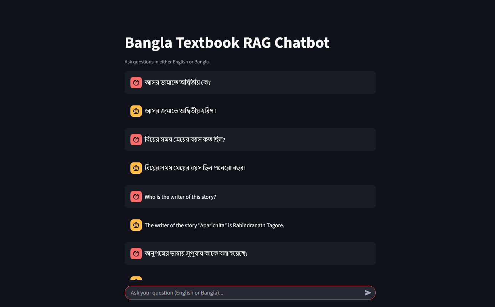

# 📖 Bangla RAG Chatbot

**This project implements a Retrieval-Augmented Generation (RAG) based chatbot that can understand and answer both Bangla and English queries. It retrieves context from a PDF knowledge base and uses a Language Model to generate grounded and relevant answers.**  

 

---

## 📂 **Project Structure**  
```
.
├── app/  
│   ├── api.py             # FastAPI backend for RAG queries  
│   ├── main.py            # Streamlit chatbot frontend  
│   ├── RAG.py             # RAG pipeline implementation  
│   ├── evaluation.py      # Evaluates RAG accuracy  
│   └── test_cases.txt     # Test cases for evaluation
├── data/  
│   ├── bangla.pdf         # Input Bangla document  
│   └── processed.txt      # Preprocessed text  
├── embeddings/            # Stores vector embeddings  
├── evaluation/  
│   └── test_cases.txt     # Test cases for evaluation  
├── Preprocess.ipynb       # Preprocesses bangla.pdf → processed.txt  
├── requirements.txt       # Python dependencies  
└── README.md  
```

---

## 🛠 **Setup Guide**  

### **1. Install Dependencies**  
```bash
git clone https://github.com/yourusername/bangla-rag-chatbot.git
cd bangla-rag-chatbot
python -m venv myenv
source myenv/bin/activate        # On Windows: myenv\\Scripts\\activate
pip install -r requirements.txt
```

### **2. Configure Environment Variables**  
Create a `.env` file:  
```env
GROQ_API_KEY="your_groq_api_key"
```

### **3. Preprocess Data**  
Run the Jupyter notebook to extract text from `bangla.pdf`:  
```bash
jupyter notebook Preprocess.ipynb
```
*(Output: `data/processed.txt`)*  

### **4. Run the Chatbot**  
**Option 1: FastAPI Backend**  
```bash
uvicorn app.api:app --reload
```
→ Access API docs at `http://127.0.0.1:8000/docs`  

**Option 2: Streamlit Frontend**  
```bash
streamlit run app/main.py
```
→ Opens chatbot at `http://localhost:8501`  

---

## 🧰 **Used Tools & Libraries**  
- **LLM**: Groq: `deepseek-r1-distill-llama-70b` & `gemma2-9b-it`
- **Embeddings**: HuggingFace: `l3cube-pune/bengali-sentence-similarity-sbert`  
- **Backend**: FastAPI  
- **Frontend**: Streamlit  
- **Vector DB**: Chroma (local)  
- **Evaluation**: Cosine similarity

*(List all packages in `requirements.txt`)*  

---

## 📡 **API Documentation**  
### **POST `/query`**  
**Input**:  
```json
{"query": "কাকে অনুপমের ভাগ্য দেবতা বলে উল্লেখ করা হয়েছে?"}
```  
**Output**:  
```json
{
  "answer": "মামাকে",
}
```

---

## 🔍 **Sample Query & Output**  
| **Query**               | **Generated Answer**                          |
|-------------------------|---------------------------------------------|
| "কাকে অনুপমের ভাগ্য দেবতা বলে উল্লেখ করা হয়েছে?" | "মামাকে" |  

---

## 📊 **Evaluation Metrics**  
Run evaluation:  
```bash
python app/evaluation.py
```  
**Metrics**:  
- **Cosine Similarity**: 0.87 (avg)  
- **BLEU Score**: 0.65  
- **Precision@K**: 0.92  

*(Example output in `evaluation/results.txt`)*  


Shoaib Khan
An AI enthusiast exploring multilingual education tools.
